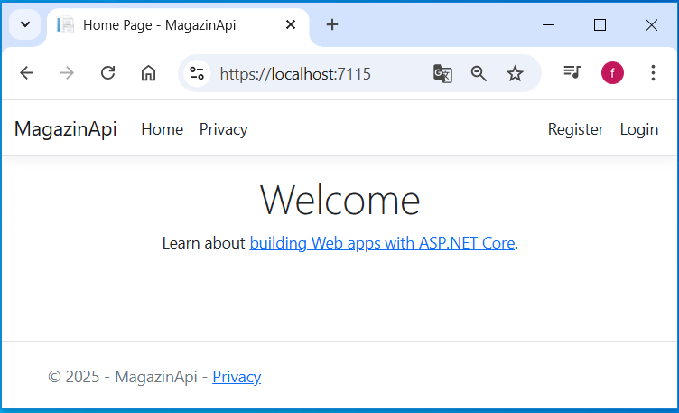
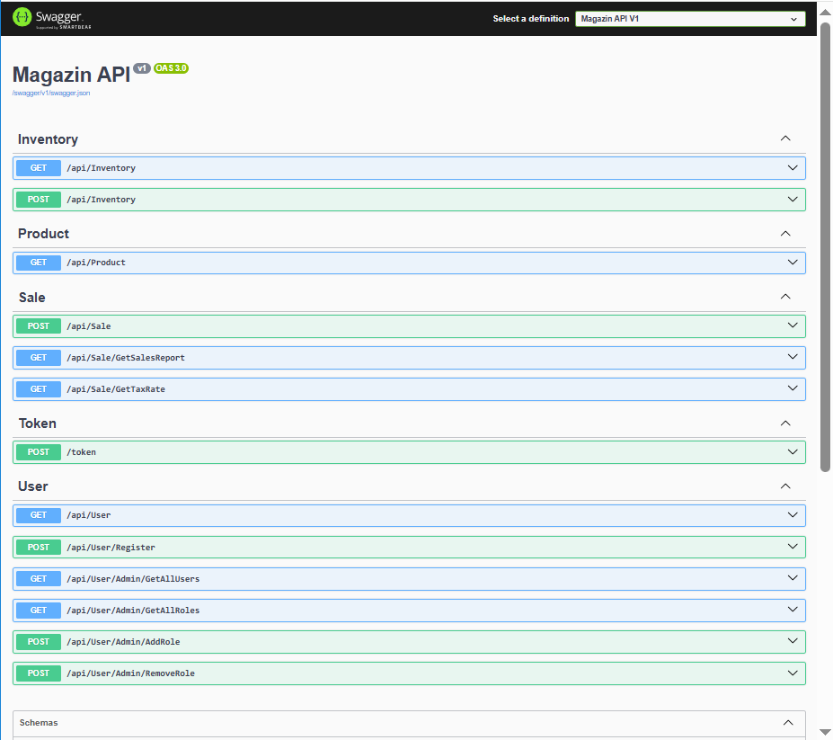
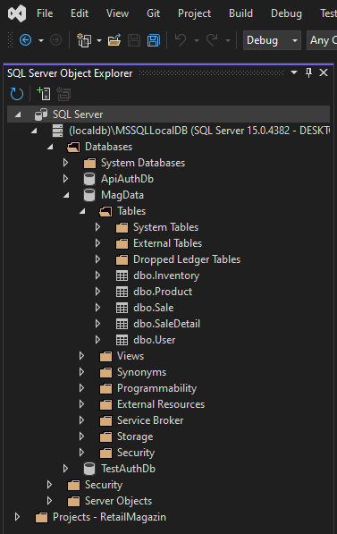
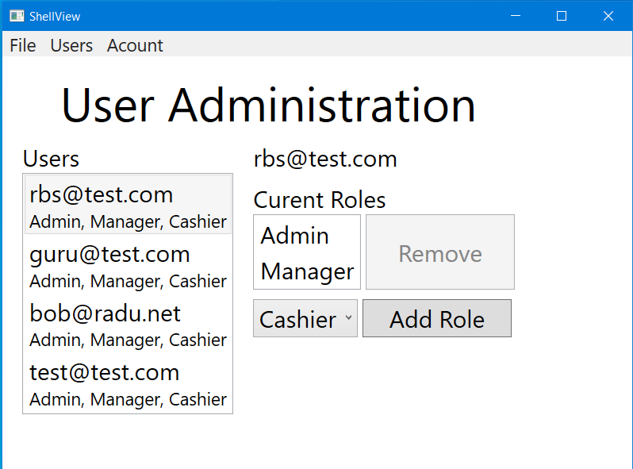
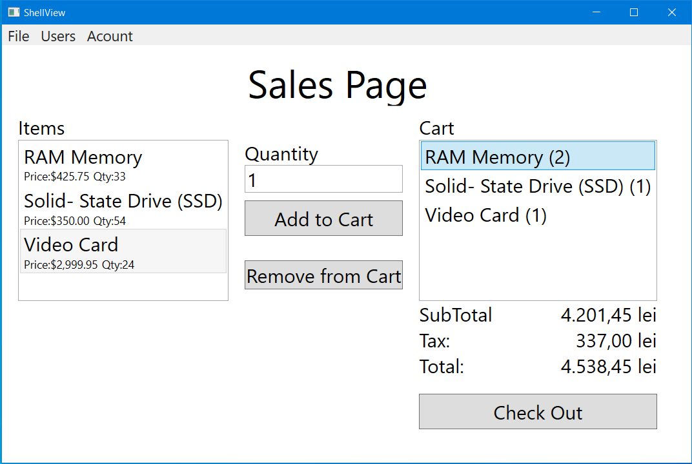
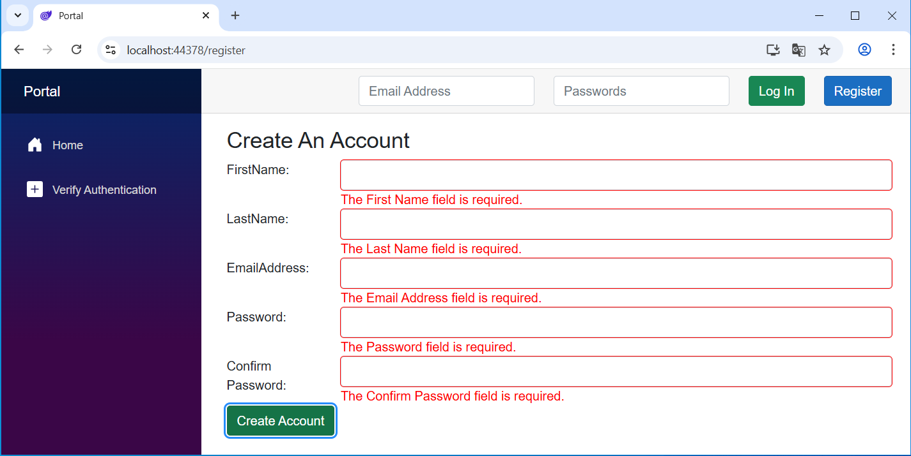

Project Magazin – MVVM

## Technologies Used
* C#
* Sql Server
* Entity Framework
* .Net Core
* ASP.NET Core Web App(M-V-C)
* WPF
* Blazor WebAssembly 

## Application Description
1. Logic level (backend):
  1.1 ApPlication MagazinApi of type ASP.NET Core Web App (Model-View-Controller)
      
     
   MagazinApi contain EndPoint-Interface-Swagger
          
  1.2 Magazin.Library of type Library
   
3. Model Date:
 2.1 MagData of type Database Sql Server
     )
   
4. User Interfaces (frontend):
  3.1 Application MagDesktopUI of type Windows Presentation Form (WPF)
      
      

   
  3.2 Application Portal of type Blazor WebAssembly Stanalone App
     
     
  3.3 MagDesktopUI.Library of type Library
